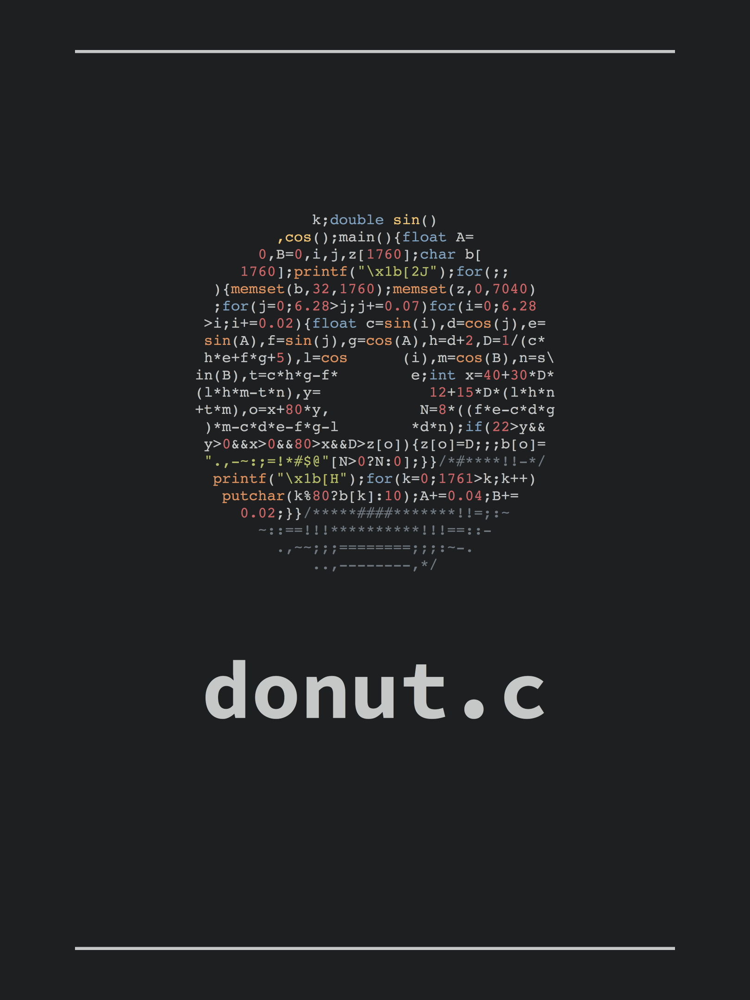

# Pretty Printf

The code that generates pretty prints like the image above.

**picasso** - The script to "paint" all of the images in the various permutations and generate the final shopify-compatible CSV

**thedream** - The **slimerjs** script to visit picasso and save the resulting image.

